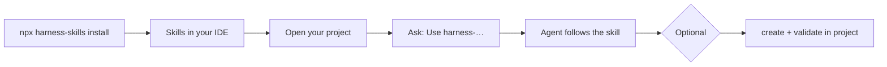

# Harness Engineering Skills

[](https://www.npmjs.com/package/harness-skills)
[](https://github.com/solanodz/harness-engineering-skills/blob/master/LICENSE)
[](https://github.com/solanodz/harness-engineering-skills/actions/workflows/ci.yml)

Agent skills for **Cursor**, **Claude Code**, and **Codex** — help coding agents finish work reliably, not just write code faster.

Based on [Learn Harness Engineering](https://walkinglabs.github.io/learn-harness-engineering/) by Walking Labs.

## What you get

Without a harness, agents often:

- forget context between sessions
- declare “done” without running tests
- do too much at once and leave things half-finished
- need you to re-explain the project every time

These skills guide the agent through a proven workflow:

| You get | How |
|---------|-----|
| **Sessions that resume cleanly** | progress files, handoffs, `init.sh` |
| **Done means verified** | tests and checks before marking complete |
| **One feature at a time** | scoped task list the agent follows |
| **Clear project rules** | short `AGENTS.md` the agent reads first |
| **Know what to fix next** | audit scores your setup 0–100 |

You install the skills **once** in your IDE. Your project stays separate — skills are not copied into your app repo unless you choose to add harness files there.

Works with **Cursor**, **Claude Code**, and **Codex** (same `SKILL.md` format, different install folders).

## Quick start

**1. Install skills**

```bash
npx harness-skills install
```

Pick global (all projects) or project-only. By default, skills install for **Cursor, Claude Code, and Codex**.

| Tool | Global path | Project path |
|------|-------------|--------------|
| Cursor | `~/.cursor/skills/` | `.cursor/skills/` |
| Claude Code | `~/.claude/skills/` | `.claude/skills/` |
| Codex | `~/.codex/skills/` | `.agents/skills/` |

Install for one tool only:

```bash
npx harness-skills install --ide cursor
npx harness-skills install --ide claude
npx harness-skills install --ide codex
```

**2. Open your project in Cursor, Claude Code, or Codex**

**3. Ask the agent to use a skill**

```
Use harness-scaffold to set up this project
```

That’s it. No config file required to start.

### Optional: add harness files to a project

If you want `AGENTS.md`, `init.sh`, and tracking files **inside a repo**:

```bash
cd /path/to/your-project
npx harness-skills create --target .
```

Then in your IDE:

```
Use harness-scaffold — replace the example features with real ones
```

Check the result:

```bash
npx harness-skills validate --target .
```

## How it works

Skills live in **your IDE** (Cursor, Claude Code, or Codex). Harness files (optional) live **in your project repo**.



## Which skill should I use?

Start with **scaffold** on a new project or **audit** on an existing one. Use the table below when something specific goes wrong.

| If this happens… | Use this skill | Say this to your agent |
|------------------|----------------|--------------------|
| Starting a new project | `harness-scaffold` | Use harness-scaffold to set up this project |
| Not sure the setup is good | `harness-audit` | Use harness-audit and show me the score |
| `AGENTS.md` is too long or vague | `harness-instructions` | Use harness-instructions to improve AGENTS.md |
| Agent forgets between sessions | `harness-state` | Use harness-state to add progress tracking |
| Messy start or end of session | `harness-lifecycle` | Use harness-lifecycle for init and handoff |
| Agent does too much at once | `harness-scope` | Use harness-scope to fix the feature list |
| Agent says done without proof | `harness-verification` | Use harness-verification before marking done |
| Done claimed but quality is poor | `harness-evaluator` | Use harness-evaluator to review with a rubric |
| Agent keeps failing, not sure why | `harness-diagnose` | Use harness-diagnose and fix the harness layer first |
| Unit tests pass, feature broken in app | `harness-e2e` | Use harness-e2e to add smoke/end-to-end checks |
| Hard to see what the agent did | `harness-observability` | Use harness-observability to improve debugging |

### Suggested order (first time)

```mermaid
flowchart LR
    A[harness-scaffold] --> B[harness-audit]
    B --> C[harness-instructions]
    C --> D[harness-state]
    D --> E[harness-lifecycle]
    E --> F[harness-scope]
    F --> G[harness-verification]
    G --> H[harness-e2e]
    H --> I[harness-evaluator]
    I --> J[harness-observability]
    J --> K[harness-diagnose]
```



You don’t need all of them on day one. Install everything once, then invoke only what you need.

## All skills

| Skill | What it helps with |
|-------|--------------------|
| [harness-scaffold](skills/harness-scaffold/) | Create a minimal harness in a new project |
| [harness-audit](skills/harness-audit/) | Score and diagnose an existing harness |
| [harness-instructions](skills/harness-instructions/) | Write a clear, short `AGENTS.md` |
| [harness-state](skills/harness-state/) | Persist progress between sessions |
| [harness-verification](skills/harness-verification/) | Require real tests before “done” |
| [harness-e2e](skills/harness-e2e/) | End-to-end and smoke tests; executable architecture rules |
| [harness-evaluator](skills/harness-evaluator/) | Independent review, sprint contracts, rubrics |
| [harness-diagnose](skills/harness-diagnose/) | Attribute failures to a harness layer; fix harness first |
| [harness-scope](skills/harness-scope/) | Keep the agent on one feature at a time |
| [harness-lifecycle](skills/harness-lifecycle/) | Clean session start, handoff, and close |
| [harness-observability](skills/harness-observability/) | Make agent runtime visible for debugging |

## Install options

| Goal | Command |
|------|---------|
| Default (interactive, all IDEs) | `npx harness-skills install` |
| Skip prompts | `npx harness-skills install --yes` |
| Cursor only | `npx harness-skills install --ide cursor` |
| Claude Code only | `npx harness-skills install --ide claude` |
| Codex only | `npx harness-skills install --ide codex` |
| This repo only | `npx harness-skills install --project` |
| Pick specific skills | `npx harness-skills install --skills harness-scaffold,harness-audit` |
| From GitHub | `npx github:solanodz/harness-engineering-skills install` |

**Remove skills**

```bash
npx harness-skills uninstall
```

Removes only skills from this package (`harness-*`). Other skills in the same folder are left untouched.

| Goal | Command |
|------|---------|
| Default (interactive) | `npx harness-skills uninstall` |
| Skip prompts | `npx harness-skills uninstall --yes` |
| This repo only | `npx harness-skills uninstall --project` |
| Cursor only | `npx harness-skills uninstall --ide cursor` |
| Specific skills | `npx harness-skills uninstall --skills harness-scaffold,harness-audit --yes` |

Legacy package name: `harness-engineering-skills` (still works).

## CLI reference

| Command | What it does |
|---------|--------------|
| `install` | Copy skills into Cursor, Claude Code, and/or Codex |
| `uninstall` | Remove harness-skills from IDE folders (catalog only) |
| `create` | Add harness files to a project |
| `validate` | Score a project harness (0–100) |
| `report` | HTML assessment report |
| `list` | Show available skills |

Common flags: `--target .` (project path), `--force` (overwrite on install), `--project` (current repo), `--ide all|cursor|claude|codex`, `--yes` (skip prompts).

## For contributors

Templates live in `templates/`. Scripts: `create-harness.mjs`, `validate-harness.mjs`. Local dev:

```bash
git clone https://github.com/solanodz/harness-engineering-skills.git
cd harness-engineering-skills
npm run dev:install
```

Publishing: see [.github/PUBLISHING.md](.github/PUBLISHING.md).

### Troubleshooting

**`Permission denied` when running `npx harness-skills` inside this repo**

If you cloned this repository and run `npx harness-skills install` from the repo root, npm may use the **local** package instead of the published one. Use one of these instead:

```bash
npm run dev:install          # recommended for local development
node scripts/cli.mjs install # explicit
npx harness-skills@latest install  # force published package
```

**Install from your own project** (not this repo):

```bash
cd ~/your-app
npx harness-skills install
```

## Learn more

- [Learn Harness Engineering](https://walkinglabs.github.io/learn-harness-engineering/)
- [OpenAI: Harness engineering](https://openai.com/index/harness-engineering/)
- [Anthropic: Effective harnesses for long-running agents](https://www.anthropic.com/engineering/effective-harnesses-for-long-running-agents)

## License

MIT — adapted from [walkinglabs/learn-harness-engineering](https://github.com/walkinglabs/learn-harness-engineering).
