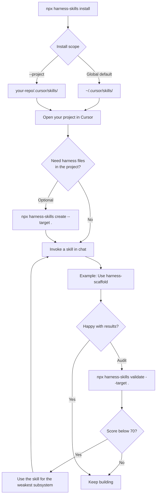
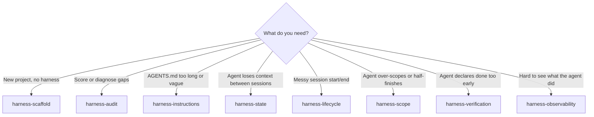

# Harness Engineering Skills

Skills for [Cursor](https://cursor.com) and other coding agents, based on the [Learn Harness Engineering](https://walkinglabs.github.io/learn-harness-engineering/) course by Walking Labs.

A **harness** does not make the model smarter: it establishes a closed-loop workflow with instructions, state, verification, scope, and session lifecycle. These skills implement those five subsystems as invocable workflows.

## Overview

### Install and use skills

Skills live in **Cursor**, not inside your app repo. Install once, then invoke them by name in chat.



### Which skill when?

Each skill maps to one or more harness subsystems. Start with **scaffold + audit**, then add others as needed.

```mermaid
flowchart LR
    subgraph phase1 [Phase 1 — Start here]
        scaffold[harness-scaffold<br/>Create minimal harness]
        audit[harness-audit<br/>Score existing setup]
    end

    subgraph phase2 [Phase 2 — Instructions]
        instructions[harness-instructions<br/>AGENTS.md map + docs/]
    end

    subgraph phase3 [Phase 3 — Sessions]
        state[harness-state<br/>progress + features]
        lifecycle[harness-lifecycle<br/>init.sh + handoff]
    end

    subgraph phase4 [Phase 4 — Control]
        scope[harness-scope<br/>feature_list.json]
        verification[harness-verification<br/>tests before done]
    end

    subgraph phase5 [Phase 5 — Debug]
        observability[harness-observability<br/>runtime visibility]
    end

    scaffold --> audit
    audit --> instructions
    instructions --> state
    state --> lifecycle
    lifecycle --> scope
    scope --> verification
    verification --> observability
```





| Subsystem | Skill | Trigger in chat |
|-----------|-------|-----------------|
| All | `harness-scaffold` | "Use harness-scaffold to set up this project" |
| All | `harness-audit` | "Use harness-audit and show the score" |
| Instructions | `harness-instructions` | "Use harness-instructions to improve AGENTS.md" |
| State | `harness-state` | "Use harness-state to design progress files" |
| Verification | `harness-verification` | "Use harness-verification before marking done" |
| Scope | `harness-scope` | "Use harness-scope to fix feature_list.json" |
| Lifecycle | `harness-lifecycle` | "Use harness-lifecycle for session handoff" |
| Observability | `harness-observability` | "Use harness-observability to add runtime logs" |

## Installation

### Option 1 — npx (recommended)

```bash
npx harness-skills install
```

This opens an **interactive picker** (all skills selected by default). Use ↑/↓, Space to toggle, `a` for all, `n` for none, Enter to confirm.

Install all skills without prompts:

```bash
npx harness-skills install --yes
```

Install skills for the current project only:

```bash
npx harness-skills install --project
```

Install a subset without the picker:

```bash
npx harness-skills install --skills harness-scaffold,harness-audit
```

Install from GitHub:

```bash
npx github:solanodz/harness-engineering-skills install
```

> **Note:** The npm package is `harness-skills`. The name `harness-engineering` is taken on npm by another project. The legacy name `harness-engineering-skills` still works for existing installs.

### Option 2 — Manual copy

```bash
git clone https://github.com/solanodz/harness-engineering-skills.git
cp -r harness-engineering-skills/skills/* ~/.cursor/skills/
```

Or install only what you need:

```bash
cp -r harness-engineering-skills/skills/harness-scaffold ~/.cursor/skills/
```

### Local development (no npm publish)

From a clone of this repo, run the CLI directly:

```bash
git clone https://github.com/solanodz/harness-engineering-skills.git
cd harness-engineering-skills

# Interactive TUI
npm run dev:install

# Other commands
npm run dev:list
npm run cli -- validate --target /path/to/project
```

Or without npm scripts:

```bash
node scripts/cli.mjs install
node scripts/cli.mjs list
```

Link globally once (optional):

```bash
npm link
harness-skills install
```

## CLI

After publishing to npm (or via `npx github:...`), use the bundled CLI:

| Command | Purpose |
|---------|---------|
| `install` | Copy skills to `~/.cursor/skills` or `.cursor/skills` (interactive by default) |
| `create` | Scaffold harness files in a target project |
| `validate` | Score a project harness (exit 1 if below threshold) |
| `report` | Write an HTML assessment report |
| `list` | List available skills in the package |

```bash
# Install all skills globally (interactive picker)
npx harness-skills install

# Install all skills without prompts
npx harness-skills install --yes

# Install selected skills into the current project
npx harness-skills install --project --skills harness-scaffold,harness-audit

# Create harness in the current directory
npx harness-skills create --target .

# Audit harness
npx harness-skills validate --target .

# HTML report
npx harness-skills report --target .
```

### Install flags

- `--global` — install to `~/.cursor/skills` (default)
- `--project` — install to `./.cursor/skills`
- `--dest DIR` — custom destination
- `--skills name,name` — install a subset (default: all)
- `--force` — overwrite existing skill directories

### Create flags

- `--target DIR` — project directory (default: current directory)
- `--agent-file AGENTS.md|CLAUDE.md`
- `--package-manager npm|pnpm|yarn|bun`
- `--commands "cmd one,cmd two"`
- `--force` — overwrite existing harness files

## Using skills in a project

See [Overview](#overview) for diagrams. Short version:

```
1. npx harness-skills install
2. npx harness-skills create --target /path/to/project   # optional
3. In Cursor: "Use harness-scaffold — replace example features with real ones"
4. npx harness-skills validate --target /path/to/project
5. Improve weak subsystems with the matching skill (see learning path below)
```

## Included skills

| Skill | Subsystem | When to use |
|-------|-----------|-------------|
| [harness-scaffold](skills/harness-scaffold/) | All | Create a minimal harness in a new project |
| [harness-audit](skills/harness-audit/) | All | Audit and score an existing harness |
| [harness-instructions](skills/harness-instructions/) | Instructions | Write AGENTS.md with progressive disclosure |
| [harness-state](skills/harness-state/) | State | Persist progress across sessions |
| [harness-verification](skills/harness-verification/) | Verification | Prevent premature victory with real tests |
| [harness-scope](skills/harness-scope/) | Scope | Control scope with feature_list.json |
| [harness-lifecycle](skills/harness-lifecycle/) | Lifecycle | init.sh, handoff, and clean state on close |
| [harness-observability](skills/harness-observability/) | Observability | Make agent runtime visible for debugging |

## Learning path (course)

```
Phase 1: harness-scaffold + harness-audit     → See the problem (P01)
Phase 2: harness-instructions                 → Agent-legible repo (P02)
Phase 3: harness-state + harness-lifecycle    → Continuity across sessions (P03)
Phase 4: harness-scope + harness-verification → Feedback and scope (P04–P05)
Phase 5: harness-observability                → Full harness (P06)
```

## Templates

Copy-ready templates in `templates/`:

- `agents.md` — agent operating manual (copied as AGENTS.md or CLAUDE.md)
- `feature-list.json` — feature list with verification
- `init.sh` — install + verification at startup
- `progress.md` — session log
- `session-handoff.md` — handoff between sessions
- `clean-state-checklist.md` — end-of-session checklist
- `evaluator-rubric.md` — post-implementation review rubric

## Scripts

The CLI wraps these commands. You can also run them directly from a clone:

```bash
# Create minimal harness in a project
node scripts/create-harness.mjs --target /path/to/project

# Audit existing harness
node scripts/validate-harness.mjs --target /path/to/project

# HTML report
node scripts/render-assessment-html.mjs --target /path/to/project
```

## References

- [Learn Harness Engineering](https://walkinglabs.github.io/learn-harness-engineering/)
- [OpenAI: Harness engineering](https://openai.com/index/harness-engineering/)
- [Anthropic: Effective harnesses for long-running agents](https://www.anthropic.com/engineering/effective-harnesses-for-long-running-agents)
- [Awesome Harness Engineering](https://github.com/walkinglabs/awesome-harness-engineering)

## License

MIT — adapted from [walkinglabs/learn-harness-engineering](https://github.com/walkinglabs/learn-harness-engineering).

## Publishing

Releases are automated via GitHub Actions when `version` in `package.json` changes on `master`. Each release publishes to npm, creates a git tag (`v1.1.0`), and opens a GitHub Release. See [.github/PUBLISHING.md](.github/PUBLISHING.md) for `NPM_TOKEN` setup.
